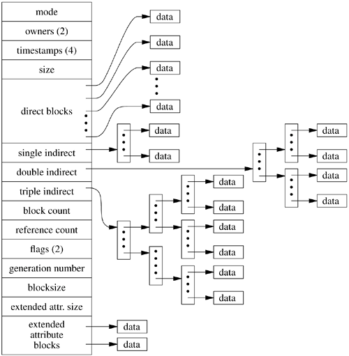

Design and architecture
===============================================================================
The main goal of VectorVFS is to store the data embeddings (vectors) into the
filesystem itself without requiring an external database. We don't want to
change the file contents and we also don't want to create extra loose files
in the filesystem. What we want is to store the embeddings on the files 
themselves without changing its data. How can we accomplish that ?

All major Linux file systems (e.g. Ext4, Btrfs, ZFS, and XFS) support a feature
that is called extended attributes (also known as xattr). This metadata is
stored in the inode itself (ona reserved space at the end of each inode) and
not in the data blocks. Some file systems might impose limits on the attributes,
Ext4 for example requires them to be within a file system block (e.g. 4kb).
Luckily we can either split embeddings into multiple attributes or we can
also reduce precision of embeddings to fit into the 4kb budget.

Below we explain a bit more what is an inode and how extended attributes
are stored in Ext4.

   Source: `FlyLib <https://flylib.com/books/en/2.849.1.103/1/>`_

What is an inode?
-------------------------------------------------------------------------------

An inode (short for "index node") is a fundamental concept in many Unix-like 
file systems, including Ext4. Each inode stores metadata about a file, but not 
the file's name or its actual content. Instead, an inode contains information such 
as:

- File size
- Timestamps (creation, modification, access)
- File permissions and ownership (UID, GID)
- Pointers to the file’s data blocks
- Link count
- Extended attributes (xattr)

When a file is created, the file system allocates an inode for it. The directory 
entry simply maps the filename to the corresponding inode number. This separation 
allows for powerful features like hard links, where multiple filenames point to 
the same inode and thus the same underlying data.

Understanding how the inode works is crucial for VectorVFS, because we leverage 
the inode's extended attribute area to store our embeddings without touching 
the file data itself.

How Ext4 stores extended attributes
-------------------------------------------------------------------------------

In Ext4, extended attributes (xattrs) are stored directly within the inode if 
space allows. The inode structure reserves an area known as the "inode extra space" 
for this purpose. Here’s how it works:

- Each inode typically has 256 bytes of standard fields.
- If the inode size (defined at file system creation time) is larger (e.g., 512 bytes, 1024 bytes),
  the extra space after the standard fields is available for storing xattrs.
- Small xattrs (typically under a few hundred bytes) are stored entirely inside the inode's extra space.
- If the xattrs cannot fit in the inode, Ext4 stores them in separate "xattr blocks" elsewhere 
  on disk and places a pointer in the inode to reference them.

For VectorVFS, our goal is to store embeddings directly in the inode when possible to minimize 
lookup overhead and maintain the embedding's tight association with the file metadata. When embeddings 
are too large to fit, we can:

- Compress or quantize the embedding to shrink its size.
- Split the embedding into multiple xattr entries.
- Allow the filesystem to automatically spill to an external xattr block if necessary.

By carefully managing the size and format of the embeddings, VectorVFS achieves seamless integration 
of vector search capabilities into the file system layer itself. In the current implementation,
VectorVFS will store embeddings of 1024D into half-precision to fit the 4kb budget.

