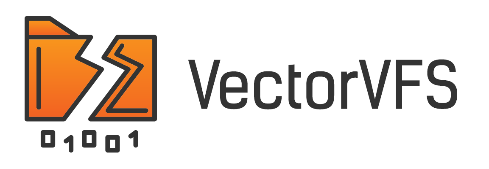

.. vectorvfs documentation master file, created by
   sphinx-quickstart on Fri Apr 25 09:47:33 2025.
   You can adapt this file completely to your liking, but it should at least
   contain the root `toctree` directive.

VectorVFS: Your Filesystem as a Vector Database
================================================

VectorVFS is a lightweight Python package that transforms your Linux filesystem into a vector database by
leveraging the native VFS (Virtual File System) extended attributes. Rather than maintaining a separate
index or external database, VectorVFS stores vector embeddings directly alongside each file—turning your
existing directory structure into an efficient and semantically searchable embedding store.

Key Features
------------
- **Zero-overhead indexing**  
  Embeddings are stored as extended attributes (xattrs) on each file, eliminating the need for external
  index files or services.
- **Seamless retrieval**  
  Perform searches across your filesystem, retrieving files by embedding similarity.
- **Flexible embedding support**  
  Plug in any embedding model—from pre-trained transformers to custom feature extractors—and let
  VectorVFS handle storage and lookup.
- **Lightweight and portable**  
  Built on native Linux VFS functionality, VectorVFS requires no additional daemons, background
  processes or databases.

.. toctree::
   :maxdepth: 4
   :caption: Contents

   installation

Indices and tables
==================

* :ref:`genindex`
* :ref:`modindex`
* :ref:`search`